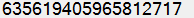

# [E-MSBuild](https://github.com/3F/E-MSBuild)

*EvMSBuild*

Advanced Evaluator of MSBuild scripts aka Advanced MSBuild with user-variables support through [Varhead](https://github.com/3F/Varhead) and more.

[](https://ci.appveyor.com/project/3Fs/e-msbuild/branch/master)
[](https://github.com/3F/E-MSBuild/releases/latest)
[](https://github.com/3F/E-MSBuild/blob/master/License.txt)
[](https://www.nuget.org/packages/E-MSBuild/)
[](https://ci.appveyor.com/project/3Fs/e-msbuild/build/tests)

[](https://ci.appveyor.com/project/3Fs/e-msbuild/history)

## License

Licensed under the [MIT License](https://github.com/3F/E-MSBuild/blob/master/License.txt)

```
Copyright (c) 2013-2019  Denis Kuzmin < x-3F@outlook.com > GitHub/3F
```

[ [ ☕ Donate ](https://3F.github.com/Donation/) ]

E-MSBuild contributors: https://github.com/3F/E-MSBuild/graphs/contributors

# Syntax and features

evaluation region (container)     | optional scope | escaping
----------------------------------|----------------|--------------
`$( … )`                        | `$( …:project )` | `$$( … )`

User Variables:

```clojure
$(name = $( … ))
```

Strings:

* `"…"` - Allows any evaluation inside string. Escaping is a `\"`
* `'…'` - All containers $() should not be evaluated for this type string. Escaping is a `\'`

*'\' and "\" used 'as is' for compatibility with MSBuild*

```clojure
$(name = "  - Platform is a $(Platform)  ")
```

```clojure
$(sPoint = $([System.DateTime]::Parse("2019/08/01").ToBinary()))
```

```clojure
$(pdir = $(ProjectDir.Replace('\', '/'):project))
```

## Increment & Decrement operators for numbers and strings

 Numbers | Strings
-----------|--------------
`$(i += 1)`| `$(name += "str")`
`$(i -= 1)`| 

`+=` and `-=` for numbers also initializes variable to **0** if it's not defined before.

```clojure
$(n = 0)
$(n += 3.14)
$(n += $(n))
```

```clojure
$(desc = "Hello ")
$(desc += "world !")
```

## Math operations

```clojure
$(numYmod = $([MSBuild]::Modulo($(numY), 12)))
$([MSBuild]::BitwiseAnd($(mask), $(v))) != 0
```

### Difference between quotes. Exponential notation problem

All data inside double quotes `".."` will be evaluated manually (standard moving: upward from deepest).

All data inside single quotes `'..'` is not processed and will be entirely sent into engine for a single final evaluation.

What does this mean, for example:

```clojure
    $([MSBuild]::Multiply("$([System.Math]::Log(2))", 16)) -> 1,10903548889591E+16
    \                     \_(1) 0,693147180559945_/
    \_______________(2)__________________________________/


    $([MSBuild]::Multiply('$([System.Math]::Log(2))', 16)) -> 11,0903548889591
    \______________________(1)___________________________/

$([System.Math]::Exp(1.10903548889591E+16)) = ∞ 
$([System.Math]::Exp(11.0903548889591)) = 65535,9999999983
```

Other samples:

Expression                                                                    | Evaluated value
------------------------------------------------------------------------------|------
$([System.Math]::Log(2))                                                      | 0,693147180559945
$([MSBuild]::Multiply('$([System.Math]::Log(2))', 16))                        | 11,0903548889591
$([System.Math]::Exp('$([MSBuild]::Multiply($([System.Math]::Log(2)), 16))')) | 65536


```clojure
$([System.Math]::Exp($([MSBuild]::Multiply('$([System.Math]::Log(10))', 4)))) 
= 9999.99999999997

$([System.Math]::Exp($([MSBuild]::Multiply($([System.Math]::Log(10)), 4)))) 
= 10000.0000000002

$([System.Math]::Exp('$([MSBuild]::Multiply($([System.Math]::Log(10)), 4))')) 
= 10000
```

```clojure
#[$(
    [System.Math]::Exp('$(
        [MSBuild]::Multiply(
            $([System.Math]::Log(10)), 
            4
        ))'
    )
)]
= 10000
```

### Min / Max

0 - n & n - 18:

```clojure
$([System.Math]::Max(0, $(n)))
$([System.Math]::Min($(n), 18))
```

n - m (`min(max($(n), $(val)), $(m))`):

```clojure
$([System.Math]::Min( $([System.Math]::Max( $(n), $(val) )), $(m) ))
```

### Bit mask

**Set**

```clojure
$(mask = 0)

$(mask = $([MSBuild]::BitwiseOr($(mask), 1)))
$(mask = $([MSBuild]::BitwiseOr($(mask), 4)))
$(mask = $([MSBuild]::BitwiseOr($(mask), 8)))

$(maskString = $([System.Convert]::ToString('$([System.Convert]::ToInt32($(mask)))', 2)))
```

Result: `1101`

**Check**

```clojure
#[$(v = 2)]

#[( $([MSBuild]::BitwiseAnd($(mask), $(v))) != 0 ){ 
    "$(v)" is defined in the mask($(maskString)) 
}
else{ 
    "$(v)" is not defined in the mask($(maskString))
}]
```

`"2" is not defined in the mask(1101)`

### The numbers of modulo

0 - 99:

```clojure
$([MSBuild]::Modulo($(num), 100))
0, 1, 2, 3, 4 ... 98, 99, 0, 1, 2 ...
```

n - m (e.g. 10 - 99):

Same as above, only use limit like: 
```
 = (val % (max - min)) + min
```

```clojure
#[$(
    [MSBuild]::Add(
        $(minrev), 
        $([MSBuild]::Modulo(
            $(num), 
            $([MSBuild]::Subtract(
                $(maxrev), 
                $(minrev)
             ))
         ))
    )
)]
10, 11, 12, ... 98, 99, 10, 11, 12 ...
```

### Raise number to the specified power

```clojure
$([System.Math]::Pow(10, 4)) 
= 10000
```

or via exp:

```clojure
$([System.Math]::Exp('$([MSBuild]::Multiply($([System.Math]::Log(10)), 4))'))
= 10000
```

## Nested levels. Recursive evaluation

```clojure
$($(…:$(…)))
```

```clojure
$($(…:$($(…:$(…)))))
```
…

Useful for any dynamic references to your data or additional evaluation. For example: 

```clojure
$(ProjectDir:$(ProjectName)) - ProjectDir value scoped by project name at runtime
```

### Global properties

To use local scoped variables as part of other msbuild properties and so on. 

```clojure
$(+name = …)
```

```clojure
$(+MyProperty = "val1")
```

To unset:

```clojure
$(-name =)
$(-name = …)
```

## Operations with strings

```clojure
$(SolutionPath.Replace('\', '/'))  -> to D:/App/ConsoleApp1.sln
$(SolutionPath.Replace('\', '\\')) -> to D:\\App\\ConsoleApp1.sln
```

```clojure
$(desc = "Hello ")
$(desc = $([System.String]::Concat($(desc), "world !")) )
```

### Escape-Sequence

Implemented a strictly limited set:

* [hexadecimal-escape-sequence](https://msdn.microsoft.com/en-us/library/aa691087%28v=vs.71%29.aspx): `\x   0-0xF  [0-0xF  [0-0xF  [0-0xF]]]`
* [unicode-escape-sequence](https://msdn.microsoft.com/en-us/library/aa664669%28v=vs.71%29.aspx): 
    * `\u   0-0xF  0-0xF  0-0xF  0-0xF` 
    * `\U   0-0xF  0-0xF  0-0xF  0-0xF  0-0xF  0-0xF  0-0xF  0-0xF`
* basic: `\r \n \t \v \a \b \0 \f`


```clojure
$([System.String]::Concat("\r\n"))
```

```clojure
$(ver = "1.2.3")
$([System.String]::Format("\t version is a {0}", $(ver)))
```

### Newline characters and other problematic symbols

```clojure
$(cs.Replace("\r\n", ""))
```

or other CR/LF combination ([Newline - representations](http://en.wikipedia.org/wiki/Newline#Representations))

```clojure
$(cs.Replace("\r", "").Replace("\n", ""))
```

## Date & Time

Format & Culture:

* [Custom Date and Time Format Strings](https://msdn.microsoft.com/en-us/library/8kb3ddd4)
* [Standard Date and Time Format Strings](https://msdn.microsoft.com/en-us/library/az4se3k1)

*Sortable format: ~ `yyyy/MM/dd`, eg.: `2016/08/21` for InvariantCulture*

For specific culture use for example:

```clojure
$([System.DateTime]::Parse("21.08.2016", '$([System.Globalization.CultureInfo]::GetCultureInfo("ru-RU"))'))
$([System.DateTime]::Parse("08/21/2016", '$([System.Globalization.CultureInfo]::GetCultureInfo("en-US"))'))
```

Number of ticks:

```clojure
$([System.DateTime]::Parse("2015/02/17").ToBinary())
$([System.DateTime]::Parse("2015/02/17 07:21").ToBinary())
```


```clojure
$([System.DateTime]::UtcNow.Ticks)
```

Total Minutes or Hours from Ticks:

```clojure
$([System.TimeSpan]::FromTicks(635618792404338780).TotalHours)
$([System.TimeSpan]::FromTicks(635618792404338780).TotalMinutes)
```

Delta between the time:

```clojure
$([System.TimeSpan]::FromTicks($([MSBuild]::Subtract(635618821282084745, 635618792404338780))).TotalMinutes.ToString("0"))
$([System.TimeSpan]::FromTicks($([MSBuild]::Subtract(635618821282084745, 635618792404338780))).TotalSeconds.ToString("0"))
```

Custom Date and Time Format Strings:

```clojure
$([System.DateTime]::UtcNow.ToString("yyyy.MM.dd_HH;mm;ss.ffff"))
```
Result: `2016.02.07_10;56;54.8265`

## Standard MSBuild Property Functions support

[Property Functions](http://msdn.microsoft.com/en-us/library/vstudio/dd633440%28v=vs.120%29.aspx):

```clojure
$([System.Guid]::NewGuid()) 
$(SolutionDir.Substring(0,3))
$([System.DateTime]::Now.ToString("yyyy.MM.dd HH:mm:ss"))  
```

[Registry Properties](https://msdn.microsoft.com/en-us/library/vstudio/ms171458.aspx):


```clojure
$(registry:Hive\MyKey\MySubKey@ValueName) - gets value for ValueName from subkey.
$(registry:Hive\MyKey\MySubKey) - gets the default subkey value.
```