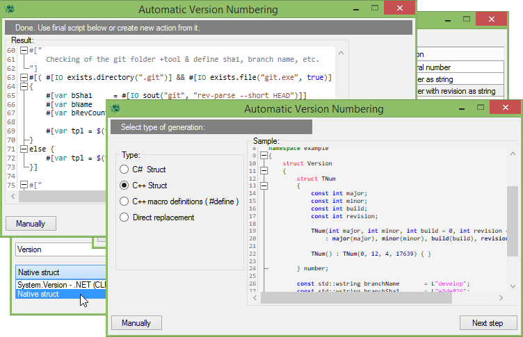

# [vsSolutionBuildEvent](https://github.com/3F/vsSolutionBuildEvent)

**Event**-Catcher with variety of advanced **Actions** to service projects, libraries, the build processes and processes at runtime from Visual Studio and MSBuild Tools.

**Flexible actions for all ...**

[](https://ci.appveyor.com/project/3Fs/vssolutionbuildevent/branch/master)
[](https://ci.appveyor.com/project/3Fs/vssolutionbuildevent/build/tests)
[](https://vssbe.r-eg.net/Changelist/#vsix)
[](https://www.nuget.org/packages/vsSBE.CI.MSBuild/)
[](https://vssbe.r-eg.net/License/)
[](https://github.com/3F/GetNuTool)

[](https://ci.appveyor.com/project/3Fs/vssolutionbuildevent/history)
[]()
[](https://youtu.be/FX5GiMX0ulI) 

[](https://vssbe.r-eg.net/Changelist/#cim)
[](https://vssbe.r-eg.net/Changelist/#devenv)
[](https://vssbe.r-eg.net/Changelist/#provider)
[](https://vssbe.r-eg.net/Changelist/#api)

**[Download](https://vssbe.r-eg.net/Downloads/)** (Binaries, Snapshots, Nightly builds, Libraries, ...) / [](https://sourceforge.net/projects/vssbe/) (old releases via sf)

* [VisualStudio Marketplace](https://visualstudiogallery.msdn.microsoft.com/0d1dbfd7-ed8a-40af-ae39-281bfeca2334)

## License

Licensed under the [LGPLv3](https://github.com/3F/vsSolutionBuildEvent/blob/master/LICENSE)

```
Copyright (c) 2013-2016,2019  Denis Kuzmin < entry.reg@gmail.com > GitHub/3F
```

[ [ ☕ Donate ](https://3F.github.com/Donation/) ]


## Why vsSolutionBuildEvent ?

Advanced handler of the most events from MS Visual Studio & MSBuild tools. Full control and flexible multi-actions for basic pre/post events and other additional such as:

* [CommandEvent](https://vssbe.r-eg.net/doc/Events/CommandEvent/), Errors, Warnings, Cancel-Build, Output-Build, Transmitter, Logging

Ability to handle events for all subprojects at once from the whole solution as an Solution-Events or individually for each separately.

Various modes for everything:

* Files Mode, Operation Mode, Interpreter Mode, [Script Mode](https://vssbe.r-eg.net/doc/Modes/Script/), [Targets Mode](https://vssbe.r-eg.net/doc/Modes/Targets/), [C# Mode](https://vssbe.r-eg.net/doc/Modes/CSharp/)

Supports [additional MSBuild](https://vssbe.r-eg.net/doc/Scripts/MSBuild/) features & [SBE-Scripts engine](https://vssbe.r-eg.net/doc/Scripts/SBE-Scripts/) for your awesome ideas.

Possible work even **without** Visual Studio. 

Provides also support of the CI-Build Servers (TeamCity, AppVeyor, Azure DevOps, ...), Command-Line mode and lot of other features for the convenience of your work with the build, tests, versioning, IO operations, and so on. See the documentation.

* [SBE-Scripts](https://vssbe.r-eg.net/doc/Scripts/SBE-Scripts/)
* [MSBuild](https://vssbe.r-eg.net/doc/Scripts/MSBuild/)
* **[Examples](https://vssbe.r-eg.net/doc/Examples/)** *- scripts, solutions, syntax etc.,*
* [Continuous Integration (CI)](https://vssbe.r-eg.net/doc/CI/)
* [Processing modes](https://vssbe.r-eg.net/doc/Modes/)
* [API](https://vssbe.r-eg.net/doc/API/)

[](https://vssbe.r-eg.net/doc/Scheme/)


* [Install & Build](https://vssbe.r-eg.net/doc/Dev/How-to-build/) ([Developer Zone](https://vssbe.r-eg.net/doc/Dev/))
* [Wiki](https://vssbe.r-eg.net/)
* [Public Issue Tracker](https://github.com/3F/vsSolutionBuildEvent/issues) 


## Advanced MSBuild

[https://vssbe.r-eg.net/doc/Scripts/MSBuild/](https://vssbe.r-eg.net/doc/Scripts/MSBuild/)

```js
#[$(
    [System.Math]::Exp('$(
        [MSBuild]::Multiply(
            $([System.Math]::Log(10)), 
            4
        ))'
    )
)]
```

```js
$(n = 0)       $(desc = "Hello ")
$(n += 3.14)   $(desc += "from vsSBE !")
$(n += $(n))   $(p1 = " Platform is $(Platform)")
```

```js
$(...)
$(...:project) - from selected project in your solution
$$(...) ... $$(...:project)
```

```js
$(tStart = $([System.DateTime]::Parse("2014/01/01").ToBinary()))
$([System.Guid]::NewGuid())

$([System.TimeSpan]::FromTicks($([MSBuild]::Subtract($(tNow), $(tStart))))
                        .TotalHours.ToString("0"))

$(pdir = $(ProjectDir:project))
$(pdir = $(ProjectDir.Replace('\', '/'):project))
```

## SBE-Scripts

[https://vssbe.r-eg.net/doc/Scripts/SBE-Scripts/](https://vssbe.r-eg.net/doc/Scripts/SBE-Scripts/)

```js
#["
    Basic example
"]
#[var v = 1.2.3]
#[var log = $(TMP)/v.txt]

#[($(Configuration) ~= Deb || true)
{
    #[var tBase     = $([System.DateTime]::Parse('2015/10/01').ToBinary())]
    #[var tNow      = $([System.DateTime]::UtcNow.Ticks)]
    #[var revBuild  = #[$(
                        [System.TimeSpan]::FromTicks('$(
                            [MSBuild]::Subtract(
                            $(tNow), 
                            $(tBase))
                        )')
                        .TotalMinutes
                        .ToString('0'))]]
    
    #[var v = $(v).$([MSBuild]::Modulo($(revBuild), $([System.Math]::Pow(2, 14))))]
}]

#[var v = $([System.String]::Format("v{0}\r\n\t", $(v)))]
#[File write("#[var log]"):> Example #[var v] Generated by vsSolutionBuildEvent]
#[IO scall("notepad", "#[var log]")]

$(n = $([System.Math]::Exp('$([MSBuild]::Multiply($([System.Math]::Log(2)), 16))')))
$(n)
```

For example, you can even exclude projects from build at runtime:

```js
#[Build projects.find("name").IsBuildable = false]
``` 

Capture data from external utilities:

```js
#[var bSha1 = #[IO sout("git", "rev-parse --short HEAD")]]
```

Work with files and archives:

```js
#[IO copy.file("$(odir)/notes.txt", "$(pDirCIM)bin\\$(cfg)\\", true)]
#[7z pack.files({
            "$(pDirBridge)bin\$(cfg)\Bridge.*.*",
            "CI.MSBuild.dll",
            "CI.MSBuild.pdb",
            "$(pDirCIM)bin\$(cfg)\*.txt"}, "$(odir)CI.MSBuild_v$(numCIM)_[$(branchSha1)][$(netStamp)].zip")]

```

+DTE-commands, +Access to all MSBuild properties on the fly, +Conditional statements and lot of other components:

```js
#[try
{
    #[Box iterate(i = 0; $(i) < 10; i += 1): 
        ...
    ]
}catch{ }]

#[( #[vsSBE events.Pre.item(1).Enabled] || ($(Configuration) == "Release" && $(sysc)) )
{
    #[Build projects.find("name").IsBuildable = false]
}
else
{
    #[var bSha1 = #[IO sout("git", "rev-parse --short HEAD")]]
    ...
}]
```

... [create **new** in 5 minutes](https://vssbe.r-eg.net/doc/Dev/New%20Component/)

## Processing modes

[https://vssbe.r-eg.net/doc/Modes/](https://vssbe.r-eg.net/doc/Modes/)

From simple commands to C# or even msbuild targets:

```xml
<?xml version="1.0" encoding="utf-8"?>
<Project ToolsVersion="4.0" xmlns="http://schemas.microsoft.com/developer/msbuild/2003">

    <Target Name="Init">
        <!-- ... -->
    </Target>

    <!--
        Additional properties:
            $(ActionName)
            $(BuildType)
            $(EventType)
            $(SupportMSBuild)
            $(SupportSBEScripts)
            $(SolutionActiveCfg)
            $(StartupProject)
    -->
</Project>
```

## CommandEvent (DTE)

You can also use this to catch all command from VS IDE. [Samples:](https://vssbe.r-eg.net/doc/Events/CommandEvent/)

```js
$(lcGuid = #[DTE events.LastCommand.Guid])
$(lcId   = #[DTE events.LastCommand.Id])

#[($(lcGuid) == "{1496A755-94DE-11D0-8C3F-00C04FC2AAE2}" && $(lcId) == 1627) {
    #[File scall("notepad", "#[var log]", 30)]
}]
```


## Automatic Version Numbering

See our [**Wizard** for automatic code generation **or** use any **custom scripts**.](https://vssbe.r-eg.net/doc/Examples/Version/)


## Different environments

You can easily use this with TeamCity, Azure DevOps, AppVeyor, and any other automated environments:


...

## Solution-wide Build events

Pre-Build / Post-Build events for all projects at once or individually for each separately: [configure what you need.](https://vssbe.r-eg.net/doc/Features/Solution-wide/)


## Stop build on first error

[Immediately stop](http://vssbe.r-eg.net/doc/Examples/Errors.Stop%20build/) (at the same time) after the first appearance (compared with StopOnFirstBuildError plugin [[?]](http://vssbe.r-eg.net/doc/Examples/Errors.Stop%20build/))


## Wiki

[Wiki](http://vssbe.r-eg.net/) - Contains help for work with plugins, basic examples, syntax, information for develop, and lot of other...

Feel free to improve any our pages. Click [Edit] button or [Start new here.](http://vssbe.r-eg.net/doc/New/)


## Questions / Bugs / Suggestions / Source Code

Welcome:

* [https://github.com/3F/vsSolutionBuildEvent](https://github.com/3F/vsSolutionBuildEvent)

## Screenshots




[**[. . .](https://vssbe.r-eg.net/Screenshots/)**]